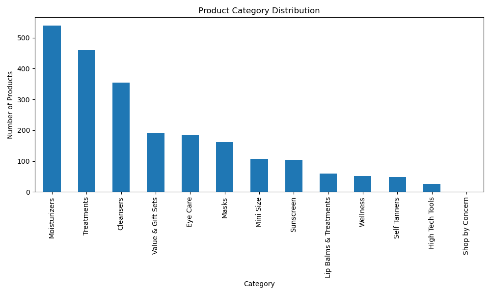
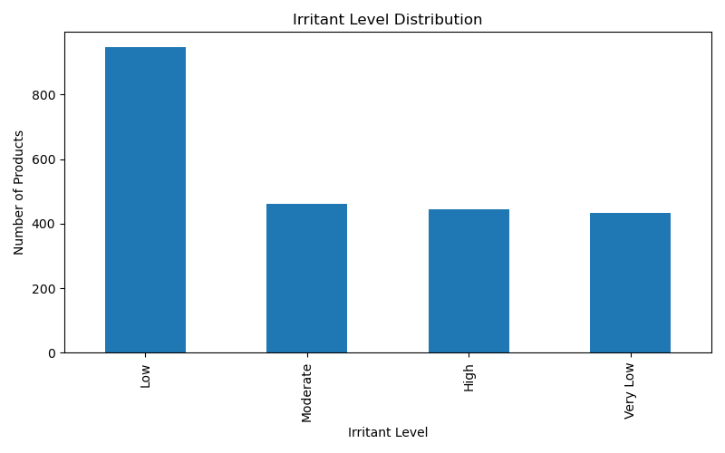
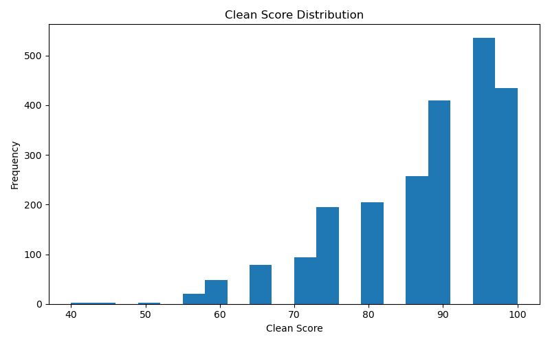
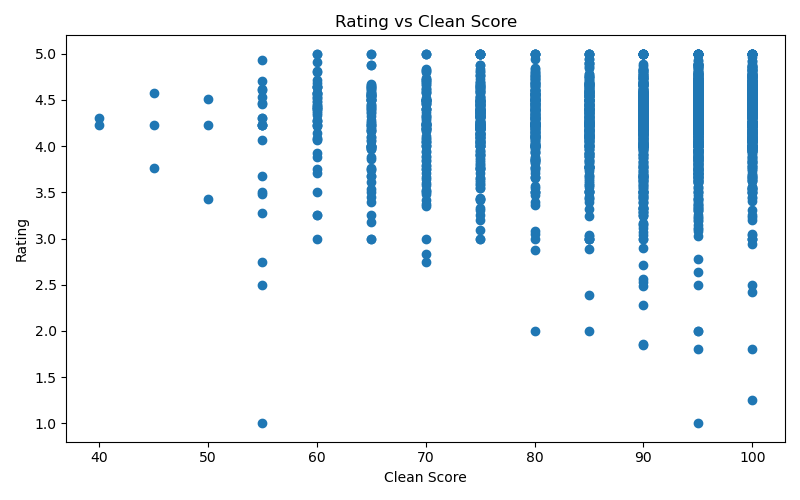

# AI-Clean-Beauty-Recommender
Personalized skincare recommendation system using ingredient analysis, feature engineering, and Streamlit.
# AI Clean Beauty Recommender

## Problem Statement

Consumers often purchase skincare products based on marketing, social media trends, influencer recommendations, or celebrity endorsements without fully understanding the ingredients they contain. Different skin types can react differently to skincare ingredients, making ingredient transparency important for informed decision-making.

This project aims to help users discover skincare products that align with their skin type, concerns, and ingredient preferences through a personalized recommendation system.

## Dataset

Source: Kaggle Sephora Skincare Dataset

The dataset contains skincare products including:

* Product Name
* Brand Name
* Ingredients
* Ratings
* Reviews
* Product Categories
* Product Highlights

## Project Status

🚧 Currently under development

### Completed

* Data Cleaning
* Ingredient Analysis
* Feature Engineering
* Recommendation System
* Streamlit Application

### In Progress

* Data Visualizations
* Machine Learning Enhancement
* Deployment

## Technologies Used

* Python
* Pandas
* Streamlit
* Jupyter Notebook
* GitHub
## Visualizations

### Product Category Distribution

### Irritant Level Distribution

### Clean Score Distribution

### Rating vs Clean Score

## Machine Learning Enhancement

To improve recommendation quality beyond rule-based filtering, a content-based recommendation system was developed using Natural Language Processing (NLP) techniques.

### Method

Product ingredient lists were transformed into numerical feature vectors using TF-IDF (Term Frequency-Inverse Document Frequency). Cosine Similarity was then applied to measure similarity between products based on their ingredient compositions.

### Workflow

1. Preprocess ingredient lists.
2. Convert ingredients into TF-IDF vectors.
3. Compute cosine similarity matrix.
4. Identify products with similar ingredient profiles.
5. Recommend products that closely match the selected product.

### Benefits

* Recommends alternatives with similar ingredient formulations.
* Identifies products with comparable skincare properties.
* Provides personalized suggestions beyond simple category matching.
* Enhances recommendation accuracy using machine learning techniques.

### Technologies Used

* Scikit-learn
* TF-IDF Vectorizer
* Cosine Similarity
* Pandas
* NumPy

### Example

Input Product:
Vitamin C Serum

Output:
Top 5 products with similar ingredient compositions and skincare benefits.
## Application Preview

### Home Page

### Recommendations

### Dashboard

